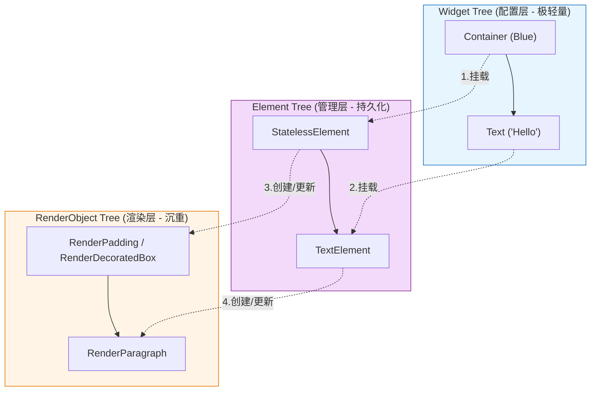

# Flutter 全栈开发实战手册 —— 基于 FinFlow 项目深度剖析

**文档说明**：
本手册专为零基础开发者设计，旨在通过深度解剖 `FinFlow` 个人记账项目，帮你从入门到精通掌握 Flutter 开发的核心技术。
全文约 1.5 万字，分为八大模块。请按顺序阅读，结合代码实践。

---

## 目录

*   **模块一：Flutter 开发环境与基础认知**
    *   1.1 什么是 Flutter？为什么选择它？
    *   1.2 Dart 语言极速入门（变量、函数、类、异步）
    *   1.3 项目结构全解（目录、配置文件、资源管理）
*   **模块二：Flutter UI 构建机制**
    *   2.1 “万物皆 Widget”的设计哲学
    *   2.2 渲染原理：Widget、Element、RenderObject 三棵树
    *   2.3 常用布局组件详解 (Row, Column, Stack, ListView)
*   **模块三：FinFlow 项目架构与入口 (`main.dart`)**
    *   3.1 程序的起点：`main()` 函数
    *   3.2 应用配置：`MaterialApp` 与 `ThemeData`
    *   3.3 路由管理与页面跳转基础
*   **模块四：数据持久化层深度解析 (`lib/data`)**
    *   4.1 数据模型设计 (`TransactionRecord`, `Bill`, `Account`)
    *   4.2 SQLite 数据库基础
    *   4.3 `sqflite` 插件实战：增删改查 (CRUD)
    *   4.4 数据库版本升级策略 (`onUpgrade`)
    *   4.5 单例模式在数据库管理中的应用
*   **模块五：首页 UI 与业务逻辑 (`home_page.dart`)**
    *   5.1 `StatefulWidget` 生命周期详解 (`initState`, `build`, `dispose`)
    *   5.2 列表渲染优化：`ListView.builder`
    *   5.3 下拉刷新与上拉加载更多 (Pagination) 实现原理
    *   5.4 状态管理：`setState` 的正确用法与局限性
*   **模块六：复杂交互实现 —— 记账弹窗 (`record_form_sheet.dart`)**
    *   6.1 底部弹窗 `showModalBottomSheet`
    *   6.2 自定义数字键盘逻辑实现
    *   6.3 表单输入与校验机制
    *   6.4 键盘事件处理与加减法运算逻辑
*   **模块七：跨平台适配与打包**
    *   7.1 Windows 桌面端适配 (窗口大小、鼠标事件)
    *   7.2 Android 端适配 (权限、图标)
    *   7.3 打包发布流程
*   **模块八：进阶思考与扩展**
    *   8.1 代码重构建议
    *   8.2 引入更高级的状态管理 (Provider/Bloc)
    *   8.3 性能优化技巧

---

## 模块一：Flutter 开发环境与基础认知

### 1.1 什么是 Flutter？为什么选择它？

Flutter 是 Google 推出的开源 UI 软件开发工具包 (SDK)。
*   **核心优势**：
    1.  **一套代码，多端运行**：你可以用同一份代码生成 Android、iOS、Windows、macOS、Linux 和 Web 应用。FinFlow 就是最好的例子，它既是安卓 App，也是 Windows 桌面软件。
    2.  **原生级性能**：不同于 React Native (中间层桥接) 或 WebView (网页套壳)，Flutter 直接将代码编译成机器码 (ARM/x86)，并通过自带的 Skia/Impeller 渲染引擎绘图，性能无限接近原生。
    3.  **热重载 (Hot Reload)**：开发时修改代码，界面瞬间更新，无需重启 App，极大地提高了开发效率。

### 1.2 Dart 语言极速入门

Flutter 使用 Dart 语言。它结合了 Java 的严谨（强类型）和 JavaScript 的灵活（函数式编程）。

#### 1.2.1 变量与类型
在 `lib/data/transaction_record.dart` 中，我们看到了大量变量定义：

```dart
// 明确类型声明
final int id;          // 整数，final 表示赋值后不可修改
final double amount;   // 双精度浮点数（小数）
String category;       // 字符串
bool isDefault;        // 布尔值 (true/false)

// 类型推断 (var)
var name = 'FinFlow'; // Dart 自动推断 name 是 String

// 空安全 (Null Safety) —— Dart 的重要特性
int? age;             // ? 表示 age 可以是整数，也可以是 null
int count;            // 没有 ?，count 必须有值，永远不能为 null
```
**解读**：FinFlow 项目全面使用了空安全。这能有效避免“空指针异常”导致 App 闪退。

#### 1.2.2 函数 (Function)
```dart
// 标准函数
int add(int a, int b) {
  return a + b;
}

// 箭头函数 (Lambda 表达式)，用于只有一行代码的函数
int sub(int a, int b) => a - b;

// 命名参数 (Named Parameters)
// 使用 {} 包裹参数，调用时必须写参数名，可读性极高
void record({required String name, int? age}) { ... }
// 调用：record(name: '张三', age: 18);
```

#### 1.2.3 类 (Class) 与构造函数
Dart 的构造函数非常简洁。
```dart
class Bill {
  final String name;
  final int id;

  // 语法糖：this.name 自动把传入的参数赋值给属性
  Bill({required this.name, required this.id});
  
  // 命名构造函数：用于从不同数据源创建对象
  // 例如：从数据库的 Map 创建 Bill 对象
  Bill.fromMap(Map<String, dynamic> map) 
      : name = map['name'],
        id = map['id'];
}
```

#### 1.2.4 异步编程 (Future, async, await)
这是前端开发中最核心的概念。
*   **同步**：代码一行行执行，上一行没做完，下一行就等着。
*   **异步**：耗时操作（如读数据库、网络请求）在后台做，主线程继续响应用户点击。

在 `lib/data/record_database.dart` 中：
```dart
// async 标记这是一个异步函数，返回一个 Future (未来)
Future<List<Account>> fetchAccounts() async {
  final db = await database; // await：暂停在这里，等数据库连接好了再往下走
  final maps = await db.query('accounts'); // await：等查询结果回来
  return maps.map((e) => Account.fromMap(e)).toList();
}
```
**关键点**：`await` 必须用在 `async` 函数里。它让异步代码写起来像同步代码一样逻辑清晰。

### 1.3 项目结构全解

打开 `d:\CODE\FinFlow`，我们逐层剖析。

#### 1.3.1 根目录
*   **`pubspec.yaml`**：**项目的灵魂**。
    *   **dependencies**：生产环境依赖。比如 `sqflite` (数据库), `path_provider` (文件路径)。
    *   **dev_dependencies**：开发环境依赖。比如 `flutter_lints` (代码规范检查)，打包时不会打进去。
    *   **flutter**：Flutter 特有配置。比如 `assets` (资源路径), `fonts` (字体)。
*   **`analysis_options.yaml`**：配置代码检查规则，比如“变量名必须驼峰命名”。
*   **`README.md`**：项目说明书。

#### 1.3.2 `lib/` 源码目录
这是你每天工作的地方。
*   **`main.dart`**：**入口文件**。包含 `main()` 函数。
*   **`data/`**：**数据层**。
    *   `transaction_record.dart`：定义数据实体（Pojo/Model）。
    *   `record_database.dart`：封装数据库操作。
*   **`ui/`**：**表现层**。
    *   `home_page.dart`：主页。
    *   `record_form_sheet.dart`：记账弹窗。

#### 1.3.3 平台目录 (`android/`, `ios/`, `windows/`)
这些是 Flutter 自动生成的原生工程壳子。
*   当你运行 `flutter run -d windows` 时，Flutter 会编译 Dart 代码，然后调用 C++ 编译器构建 `windows/` 目录下的工程，最终生成 `.exe`。
*   通常你不需要修改这里的文件，除非你要写原生插件（比如调用 Windows 特有的 API）。

---

## 模块二：Flutter UI 构建机制

### 2.1 “万物皆 Widget”的设计哲学

在 Flutter 中，**界面上的任何东西都是 Widget (组件)**。
*   看到的文字是 `Text` Widget。
*   图片是 `Image` Widget。
*   布局用的行是 `Row` Widget，列是 `Column` Widget。
*   甚至“居中”这个动作也是一个 `Center` Widget，“内边距”也是一个 `Padding` Widget。

**代码示例**：
```dart
Center( // 居中 Widget
  child: Padding( // 内边距 Widget
    padding: EdgeInsets.all(8.0),
    child: Text('Hello'), // 文本 Widget
  ),
)
```
这种嵌套结构构成了**Widget Tree (组件树)**。

### 2.2 深入理解渲染原理：三棵树的奥秘

在 Flutter 中，你写的代码虽然只是简单的 Widget 嵌套，但底层其实运行着一套极其精密的“三树协同”机制。理解这三棵树，是进阶 Flutter 高手的必经之路。

#### 1. 核心概念与分工

*   **Widget Tree (组件树)**：
    *   **角色**：**配置单 (Blueprint)**。
    *   **特点**：它是声明式的、不可变的 (Immutable)。Widget 只是简单的 Dart 对象，创建和销毁的速度极快。
    *   **工作方式**：每次你调用 `setState`，Flutter 都会从当前节点向下重新创建整棵 Widget 树。你可以把它想象成电影的“剧本”，改一个字就要重印一页。
*   **Element Tree (元素树)**：
    *   **角色**：**中间层/管理者 (Manager)**。
    *   **特点**：它是持久的、可变的。它负责管理生命周期，并决定是否需要更新底层的渲染对象。
    *   **工作方式**：它是“剧组导演”。它拿着新旧两份剧本（Widget 树）做对比。如果发现角色没变（Widget 类型和 Key 相同），它就不会换掉演员（Element），只是告诉演员改一下台词（更新属性）。
*   **RenderObject Tree (渲染树)**：
    *   **角色**：**执行者/画匠 (Painter)**。
    *   **特点**：它是真正负责计算位置 (Layout) 和绘制像素 (Paint) 的对象。
    *   **工作方式**：它是“摄影机前的演员”。它非常沉重，重新创建一个演员代价巨大。所以导演（Element）会尽量让同一个演员演到底，只要求他换个衣服或改个表情。

#### 2. 三树协同流程图



#### 3. 性能的核心：Diffing 算法

假设你把 Container 的颜色从 **蓝色** 改成了 **红色**：

1.  **Widget 树**：重新创建整个 Container Widget 对象。
2.  **Element 树**：对比发现新旧 Widget 的类型 (Type) 是一样的。于是 Element **保持不变**，只是更新了自己对新 Widget 的引用。
3.  **RenderObject 树**：Element 通知 RenderObject：“颜色变了”。RenderObject 只需要执行 `markNeedsPaint()`，在下一帧重新涂色即可，**不需要重新计算大小和位置**。

**这就是 Flutter 性能卓越的秘密**：通过轻量级 Widget 的频繁重建，换取重量级 RenderObject 的高频复用。

#### 4. 优化启示：`const` 的魔力

当你写 `const Text('Hello')` 时：
*   这个 Widget 在编译期就已经确定了，在内存中只有一个实例。
*   当父组件 `setState` 时，Flutter 看到这个 Widget 是 `const` 且引用没变，会直接跳过它的对比过程。
*   **结论**：多用 `const`，就是给 Element 树“减负”，让 Diffing 算法直接命中缓存。

### 2.3 常用布局组件详解

在 `home_page.dart` 中，我们大量使用了这些布局：

*   **`Column` (垂直布局)**：
    *   `mainAxisAlignment`: 主轴（垂直方向）对齐方式。比如 `center` (居中), `spaceBetween` (两头对齐)。
    *   `crossAxisAlignment`: 交叉轴（水平方向）对齐方式。
*   **`Row` (水平布局)**：属性与 Column 类似，但方向相反。
*   **`Stack` (层叠布局)**：类似 Photoshop 的图层。允许一个 Widget 盖在另一个上面。
*   **`Expanded` (弹性填充)**：在 Column/Row 中使用。表示“占用剩余的所有空间”。
    *   在 FinFlow 首页，列表部分包裹在 `Expanded` 里，所以它能填满屏幕剩下的部分，且可以滚动。

---

## 模块三：FinFlow 项目架构与入口 (`main.dart`)

### 3.1 程序的起点：`main()`

```dart
void main() {
  runApp(const FinFlowApp());
}
```
`runApp` 是 Flutter 的引擎启动指令。它接受一个根 Widget，将其挂载到屏幕上。

### 3.2 应用配置：`MaterialApp`

`FinFlowApp` 返回了一个 `MaterialApp`。这是 Google Material Design 风格的应用框架。

```dart
MaterialApp(
  title: 'FinFlow', // 任务管理器中显示的名字
  theme: ThemeData( // 全局主题配置
    useMaterial3: true, // 启用新版 Material 3 设计
    colorScheme: ColorScheme.fromSeed( // 自动配色系统
      seedColor: const Color(0xFF3B3B3B), // 给定一个种子色（深灰）
      // Flutter 会自动计算出主色、辅色、背景色、文字颜色，保证视觉和谐
    ),
    scaffoldBackgroundColor: const Color(0xFFF6F6F6), // 全局页面背景色（浅灰）
  ),
  home: const HomePage(), // 默认显示的页面
)
```
**设计亮点**：FinFlow 使用了 `ColorScheme.fromSeed`。这是 M3 (Material 3) 的核心。你不需要一个个指定按钮颜色、文字颜色，只需给一个主色调，系统会自动生成一套符合无障碍标准的配色方案。

---

## 模块四：数据持久化层深度解析 (`lib/data`)

这是 FinFlow 的后端逻辑部分。

### 4.1 数据模型设计

`TransactionRecord` 类不仅是数据的载体，还负责了**序列化**。

```dart
// 将对象转为 Map，用于存入数据库
Map<String, Object?> toMap() {
  return {
    'id': id,
    'amount': amount,
    'date': date.toIso8601String(), // 数据库不存 DateTime 对象，存字符串
    // ...
  };
}

// 从 Map 转为对象，用于从数据库读取
static TransactionRecord fromMap(Map<String, Object?> map) {
  return TransactionRecord(
    id: map['id'] as int?,
    amount: (map['amount'] as num).toDouble(), // 兼容 int 和 double
    date: DateTime.parse(map['date'] as String), // 字符串转回 DateTime
    // ...
  );
}
```
**注意**：`amount` 字段从数据库读出来可能是 `int` (如果存的是 10)，也可能是 `double` (10.5)。所以用 `(map['amount'] as num).toDouble()` 是最安全的写法。

### 4.2 SQLite 数据库基础

Flutter 使用 `sqflite` 插件操作 SQLite。
SQLite 是一个嵌入式关系型数据库，文件就存在手机里（`finflow.db`），不需要联网，非常适合记账这种隐私应用。

### 4.3 单例模式 (`record_database.dart`)

```dart
class RecordDatabase {
  // 1. 私有构造函数，防止外部 new RecordDatabase()
  RecordDatabase._internal();
  
  // 2. 静态变量持有唯一实例
  static final RecordDatabase instance = RecordDatabase._internal();
  
  // 3. 数据库连接对象
  sqflite.Database? _database;
  
  // 4. 获取数据库的 getter
  Future<sqflite.Database> get database async {
    if (_database != null) return _database!;
    _database = await _initDatabase(); // 懒加载：第一次调用时才初始化
    return _database!;
  }
}
```
**为什么要用单例？**
数据库连接是昂贵的资源，且 SQLite 默认支持单线程写入。如果每次操作都打开一个新连接，不仅慢，还可能导致文件锁冲突（Database Locked Error）。单例模式保证了全局只有一个连接。

### 4.4 数据库版本升级 (`onUpgrade`)

在 `_initDatabase` 中：
```dart
openDatabase(
  path,
  version: 3, // 当前数据库版本
  onCreate: _createDb, // 第一次安装时调用
  onUpgrade: _upgradeDb, // 升级时调用
)
```
`_upgradeDb` 是核心：
```dart
Future<void> _upgradeDb(Database db, int oldVersion, int newVersion) async {
  if (oldVersion < 2) {
    // 版本 1 -> 2：增加了账本 (Bills) 功能
    await db.execute('ALTER TABLE records ADD COLUMN bill_id INTEGER...');
  }
  if (oldVersion < 3) {
    // 版本 2 -> 3：增加了账户 (Accounts) 功能
    await db.execute('ALTER TABLE records ADD COLUMN account_id INTEGER...');
  }
}
```
**设计哲学**：**增量升级**。我们检查 `oldVersion`，依次执行升级脚本。这样无论用户是从 v1 升级到 v3，还是 v2 升级到 v3，都能正确迁移数据。

---

## 模块五：首页 UI 与业务逻辑 (`home_page.dart`)

### 5.1 StatefulWidget 生命周期

`HomePage` 是 `StatefulWidget`，它有生命周期：
1.  **`createState()`**：创建状态对象 `_HomePageState`。
2.  **`initState()`**：初始化。我们在这里调用 `_initDefaults()` 加载数据。**注意：这里不能直接进行异步 UI 操作，通常只做变量初始化或触发异步任务。**
3.  **`build()`**：构建界面。每次 `setState` 都会触发。
4.  **`dispose()`**：销毁。页面关闭时调用。**必须在这里释放资源**，比如 `_tabController.dispose()`，否则会内存泄漏。

### 5.2 列表渲染优化：`ListView.builder`

首页展示交易记录，可能成百上千条。
**错误写法**：
```dart
ListView(
  children: [Item1, Item2, ... Item1000]
)
```
这样会一次性创建 1000 个 Widget，瞬间卡死。

**FinFlow 写法**：
```dart
ListView.builder(
  itemCount: _records.length,
  itemBuilder: (context, index) {
    return _buildRecordItem(_records[index]);
  },
)
```
`builder` 是**懒加载**的。它只创建屏幕上可见的几个 Item。当你滚动时，上面的销毁，下面的创建。即使有 10 万条数据，内存占用也和 10 条一样，丝般顺滑。

### 5.3 下拉刷新与上拉加载更多

FinFlow 实现了**分页加载**逻辑：
1.  **变量定义**：`_loadingMore` (正在加载更多), `_hasMore` (还有没有数据)。
2.  **滚动监听**：
    ```dart
    _recordScrollController.addListener(() {
      // pixels: 当前滚动位置
      // maxScrollExtent: 最大滚动距离（到底部）
      if (_recordScrollController.position.pixels >= 
          _recordScrollController.position.maxScrollExtent - 80) {
        // 距离底部还有 80 像素时，提前触发加载
        _loadMore();
      }
    });
    ```
3.  **数据追加**：
    `_loadMore` 从数据库查出下 2 天的数据，通过 `setState` 里的 `_records.addAll(newRecords)` 追加到列表末尾。

---

## 模块六：复杂交互实现 —— 记账弹窗 (`record_form_sheet.dart`)

这是 FinFlow 交互最复杂的部分。

### 6.1 底部弹窗

使用 `showModalBottomSheet`。
`isScrollControlled: true` 是个关键参数。如果不加，弹窗只能占屏幕一半高度；加了之后，弹窗高度可以由内容决定，甚至全屏。

### 6.2 自定义数字键盘

FinFlow 没有使用系统的软键盘 (`TextField` 的 `keyboardType: TextInputType.number`)。
**原因**：
1.  系统键盘样式不统一，且无法定制“完成”、“再记一笔”等按钮。
2.  系统键盘会把界面顶上去，体验不好。

**实现**：
我们用 `GridView` 画了一个 4列 x 4行 的网格。
每个格子是一个按钮（数字 0-9，加减号，小数点，删除键，确认键）。

### 6.3 键盘逻辑核心 (`_handleKey`)

这是一个典型的**状态机**逻辑。

变量：
*   `_leftValue`：左操作数（比如 "12"）
*   `_operator`：操作符（比如 "+"）
*   `_rightValue`：右操作数（比如 "8"）

逻辑：
1.  **初始状态**：`_leftValue = "0"`, `_operator = null`。
2.  **输入数字 "1", "2"**：追加到 `_leftValue` -> "12"。
3.  **点击 "+"**：设置 `_operator = "+"`。
4.  **输入数字 "8"**：因为 `_operator` 不为空，追加到 `_rightValue` -> "8"。
5.  **点击 "=" 或 "保存"**：
    *   计算 `double.parse("12") + double.parse("8")` -> 20.0。
    *   将结果存回 `_leftValue` -> "20"。
    *   清空 `_operator` 和 `_rightValue`。

这个逻辑封装在 `_handleKey` 方法中，每次按键都调用 `setState` 更新界面显示的 `_amountText`。

### 6.4 细节处理：删除键 (Backspace)

删除键的逻辑非常细腻：
```dart
void _handleBackspace() {
  if (_operator == null) {
    // 没操作符，删左边的数
    _leftValue = _leftValue.substring(0, _leftValue.length - 1);
  } else if (_rightValue.isNotEmpty) {
    // 有右边的数，删右边的
    _rightValue = _rightValue.substring(0, _rightValue.length - 1);
  } else {
    // 右边没数了，但有操作符，删操作符（回到只输了左边数的状态）
    _operator = null;
  }
}
```
这种逻辑保证了用户的每一次点击都符合直觉。

---

## 模块七：跨平台适配与打包

### 7.1 Windows 桌面端适配

在 `lib/data/record_database.dart` 中：
```dart
if (Platform.isWindows) {
  sqfliteFfiInit(); // 初始化 FFI (外部函数接口)
  databaseFactory = databaseFactoryFfi; // 使用 FFI 版的数据库工厂
}
```
这是因为 `sqflite` 底层依赖 Android/iOS 的原生 SQLite 库。Windows 上没有原生环境，所以需要用 `sqflite_common_ffi`，它通过 Dart FFI 直接调用打包好的 `sqlite3.dll`。

### 7.2 打包发布

#### Android APK
```bash
flutter build apk --release
```
生成的文件在 `build/app/outputs/flutter-apk/app-release.apk`。

#### Windows Exe
```bash
flutter build windows --release
```
生成的文件在 `build/windows/runner/Release/`。注意：你需要把该目录下的所有文件（包括 .dll 和 data 文件夹）一起打包发给用户，不能只发一个 .exe。

---

## 模块八：进阶思考与扩展

### 8.1 代码重构建议

目前的 FinFlow 代码结构简单直接，但在大型项目中，我们通常会分层更细：
*   **Repository 层**：`RecordDatabase` 只负责 SQL 操作，不应包含业务逻辑。应创建一个 `TransactionRepository` 来处理数据转换和业务规则。
*   **Bloc/Provider 层**：目前状态管理全靠 `setState`。如果页面很复杂，会导致 `build` 方法过于庞大。建议引入 `Provider` 或 `Bloc`，将逻辑从 UI 中剥离。

### 8.2 性能优化

1.  **const 优化**：所有不依赖变量的 Widget（如 `Padding`, `SizedBox`, 固定的 `Text`）都加上 `const`。这能大幅减少 GC (垃圾回收) 压力。
2.  **图片缓存**：如果列表里有图片，要使用 `cached_network_image`。
3.  **数据库索引**：目前的表没有建索引。如果数据量达到 10 万级，按日期查询会变慢。可以在 `date` 字段上建立索引：
    ```sql
    CREATE INDEX idx_records_date ON records(date);
    ```

### 8.3 结语

通过阅读本手册并结合 FinFlow 源码，你已经迈过了 Flutter 的门槛。
这个项目虽然不大，但“麻雀虽小，五脏俱全”，涵盖了客户端开发的 80% 核心技能点：**UI 布局、状态管理、数据库、异步编程、硬件交互**。

**接下来的路**：
1.  **动手修改**：尝试给 FinFlow 增加一个“按月统计”的饼图功能。
2.  **阅读源码**：按住 Ctrl 点击 Flutter 的系统类（如 `ListView`），看看 Google 工程师是怎么写的。
3.  **持续学习**：Flutter 更新很快，关注 Flutter 官网和社区。

祝你在 Flutter 的世界里构建出改变世界的应用！
